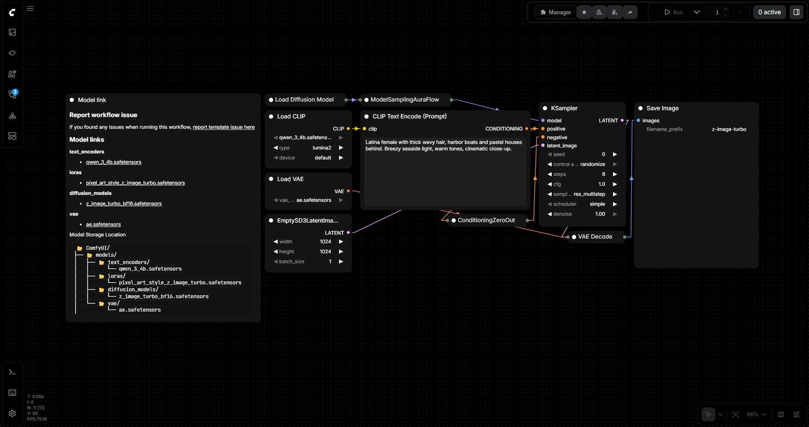
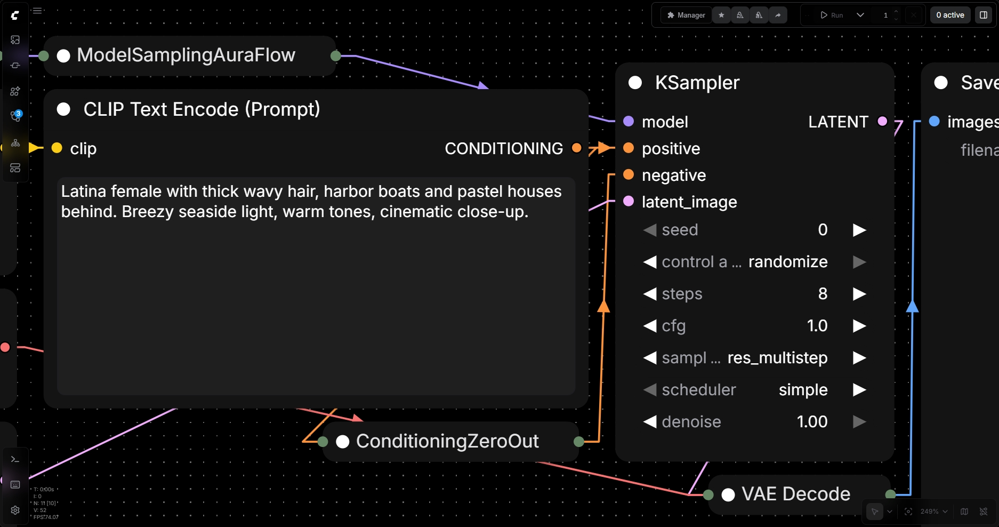
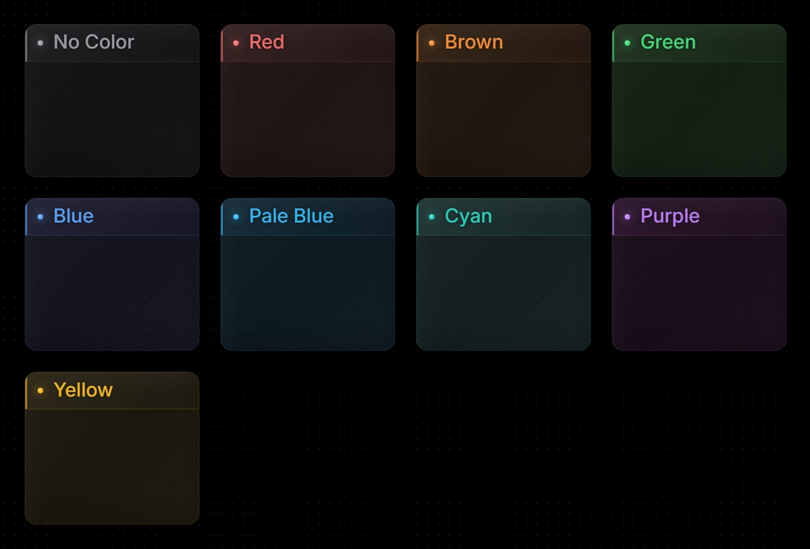
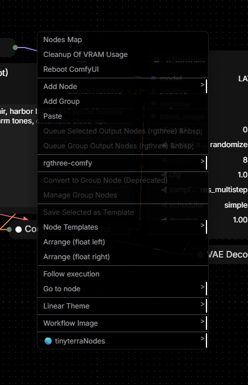
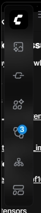
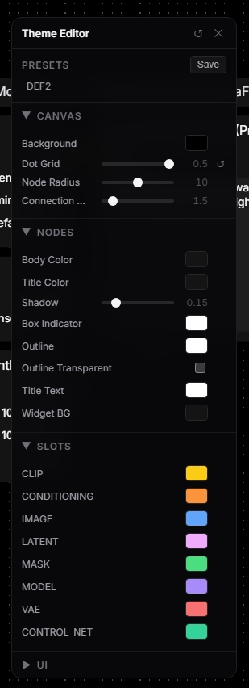

# ComfyUI Linear Theme

A dark, minimal theme for ComfyUI inspired by [Linear](https://linear.app), [Vercel](https://vercel.com), and [Raycast](https://www.raycast.com).

Pure black canvas, glassmorphism bars, no shadows. Every pixel is intentional.







<p>
  
  
</p>

## Features

- **Full CSS overhaul** — nodes, widgets, sidebars, dialogs, menus, buttons, inputs, scrollbars, tooltips, and more
- **Glassmorphism UI** — top bar, bottom toolbar, sidebar, and floating panels with backdrop blur
- **Context menu** — styled with rounded corners, separators, and hover effects
- **Theme Editor** — right-click → Linear Theme → Theme Editor to customize everything in real time
- **Execution glow** — running nodes pulse white, completed flash green, errors flash red
- **Collapsed titles** — full title always visible on collapsed nodes
- **Styled groups** — muted color palette, LED dot badge, frosted glass effect, inner shadows
- **Dot grid background** — clean minimal canvas grid
- **Color palette** for LiteGraph canvas — nodes, links, slots
- Loads automatically as a custom node extension

## Theme Editor

Built-in floating panel to tweak the theme live:



- **Canvas** — background color, dot grid opacity, node radius, connection width
- **Nodes** — body, title, shadow, outline, widget colors
- **Slots** — per-type connection colors (CLIP, MODEL, IMAGE, etc.)
- **UI** — surfaces, borders, text colors, bars glassmorphism (color + opacity)
- Per-field reset, save/load presets, persist across sessions

## Install

### Option 1: Clone into custom_nodes

```bash
cd ComfyUI/custom_nodes
git clone https://github.com/Arroz-11/ComfyUI-Linear-Theme.git
```

### Option 2: Manual

1. Download this repo
2. Copy the folder into `ComfyUI/custom_nodes/`
3. Restart ComfyUI

### Color palette (optional)

Import `linear_dark.json` in **Settings > Appearance > Color Theme > Import** for the full canvas color palette.

## License

MIT
